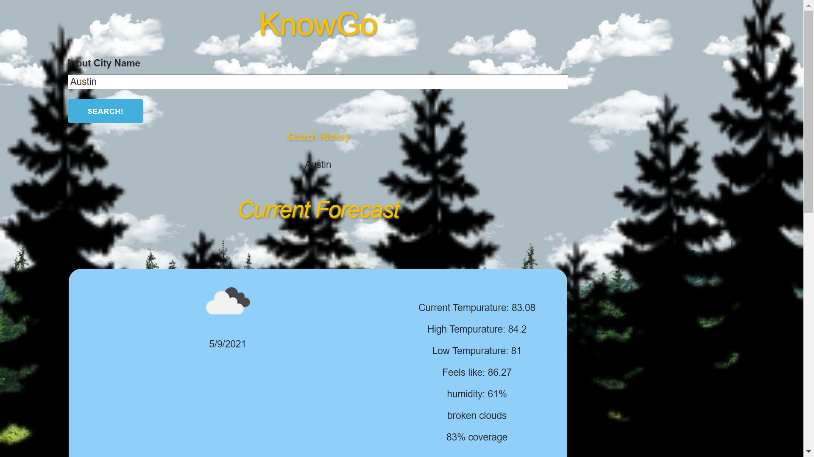
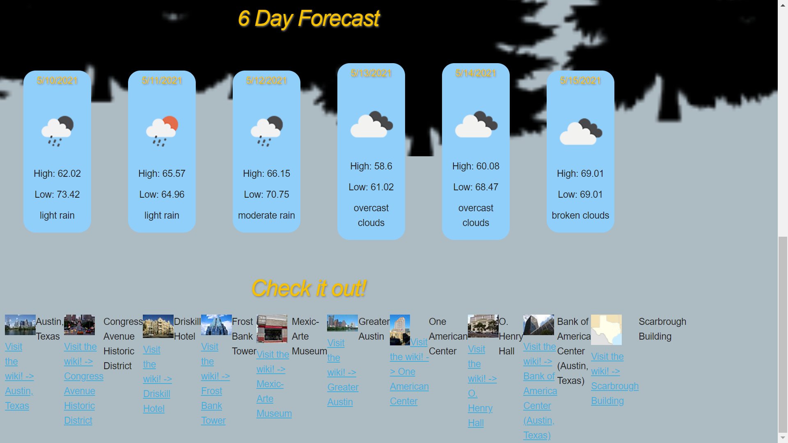

# Title 
KnowGO
## Purpose
KnowGo allows you to see current and future weather conditions as well as information about the area based upon user input

## Built With
HTML
CSS 
JavaScript
CDN - Skeleton - http://getskeleton.com/
APIs - https://api.openweathermap.org/data/2.5/weather?q=
     - https://api.openweathermap.org/data/2.5/forecast?q=
     - https://geocode.search.hereapi.com/v1/geocode?q=
     - https://en.wikipedia.org/w/api.php

## Website
Repo link - https://github.com/Chrisdocs/weatherornot
Site link - https://chrisdocs.github.io/weatherornot/

## Website Image

## Contribution
Chris Wolfe
Chris Donovan
Yajaira Gracia